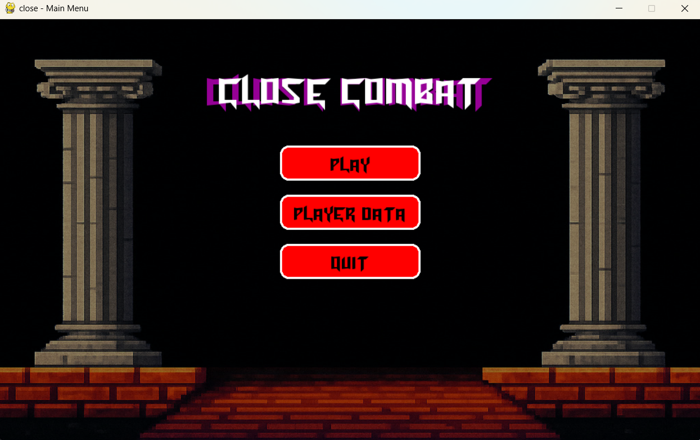
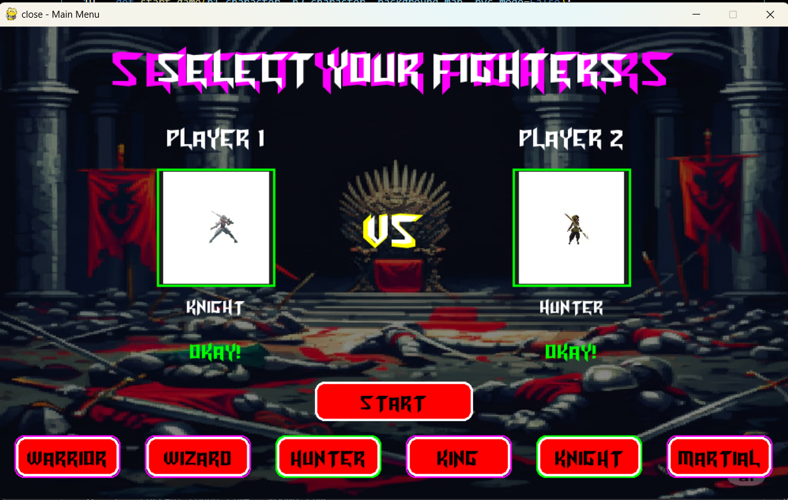
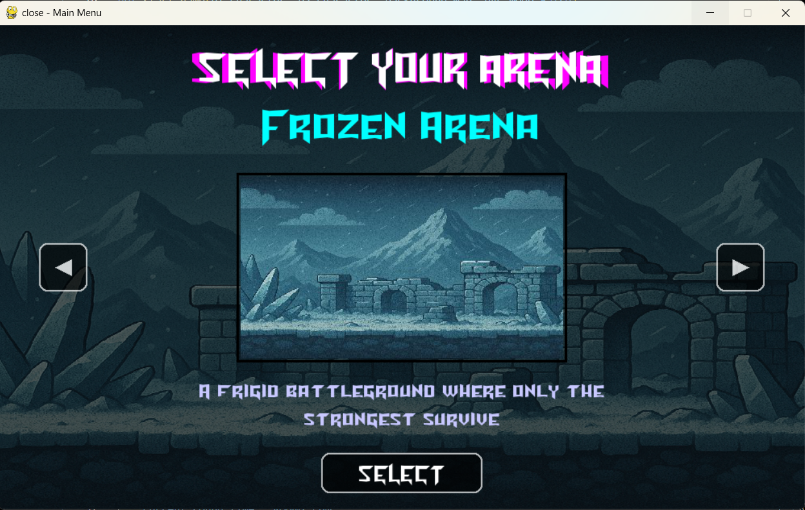
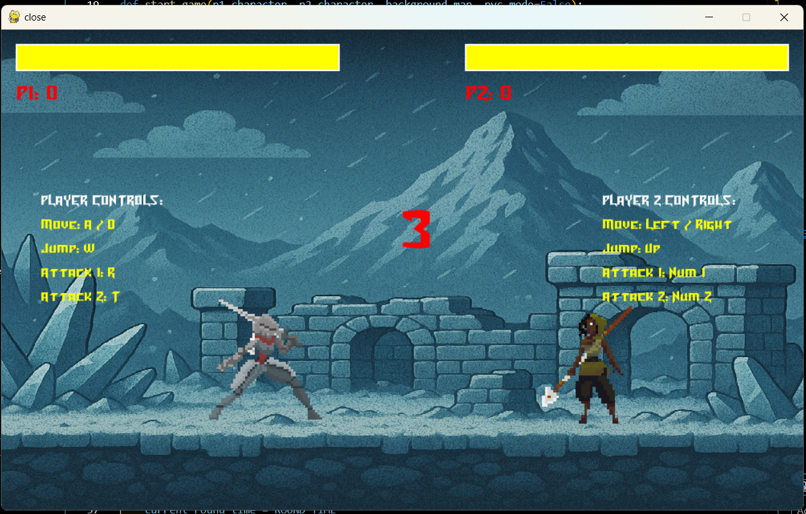
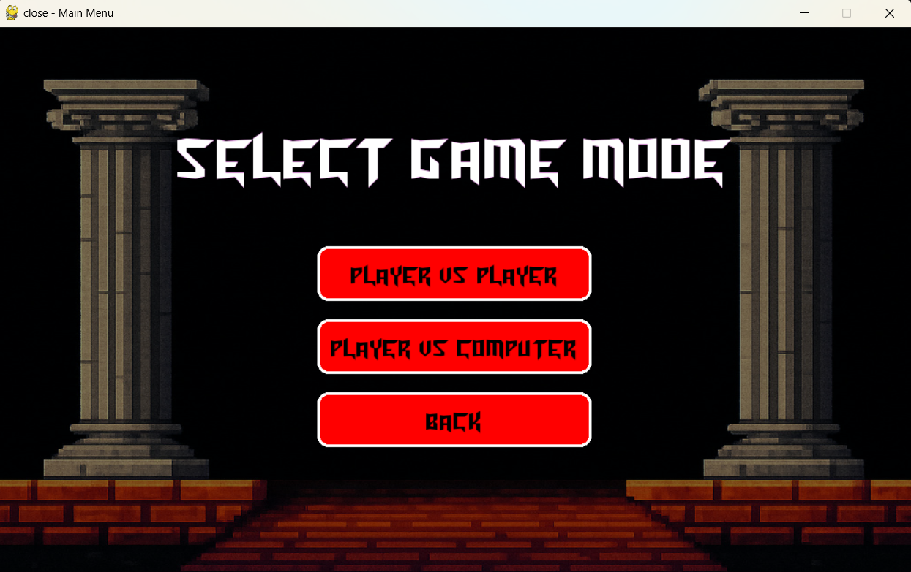
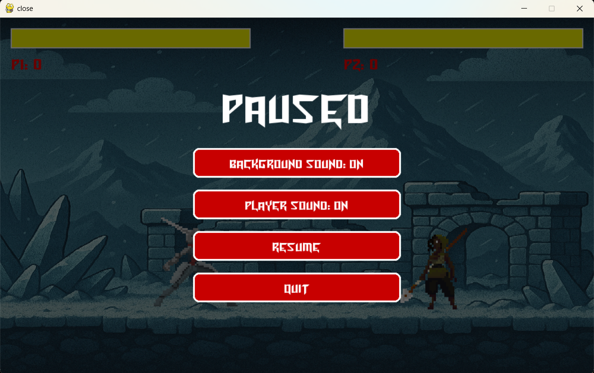
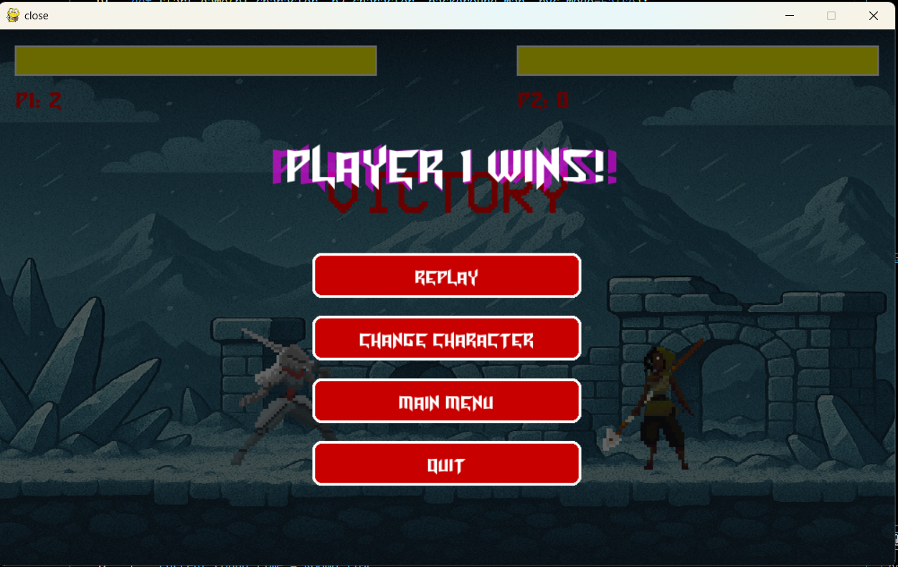

# 🥊 Close Combat – 2D Fighting Game

[](https://www.python.org/downloads/)
[](https://www.pygame.org/)
[](LICENSE)
[](https://www.microsoft.com/windows)

---

### 👨‍💻 Developed By:

**Bhavesh Vyas**, **Chirag Maheshwari**, **Bhavin Prajapat**, **Adityaraj Singh**  
_(Final Year BCA Project – 2024–2025)_

---

## 📘 Abstract

**Close Combat** is a 2D arcade-style fighting game built using **Python** and **Pygame**.  
It combines the thrill of classic fighting games with modern programming techniques.  
The project features **AI opponents**, **local multiplayer**, **multiple characters**, and **SQLite-based statistics tracking**.  
Developed as a **final-year academic project**, it demonstrates advanced knowledge of **game programming, UI/UX design, and AI logic**.

---

## 🎯 Project Objectives

- Develop a complete 2D fighting game using **Python and Pygame**.
- Implement **two gameplay modes**: Player vs Player and Player vs AI.
- Design an interactive **menu system** and polished **user interface**.
- Integrate a **local database** to track matches and player stats.
- Package the project as a **standalone executable** for distribution.

---

## 🧠 Learning Outcomes

- Mastery of **game loop architecture** and event-driven programming.
- Implementation of **AI decision-making** and movement logic.
- Modular coding for **maintainability and reusability**.
- Improved teamwork, version control, and iterative testing.
- Gained experience in **animation systems** and performance optimization.

---

## 🎮 Game Features

### Core Gameplay

- Smooth combat mechanics with responsive controls.
- Dual game modes: **Player vs Player** and **Player vs AI**.
- Six unique fighters, each with distinct fighting styles.
- Seven immersive battle arenas with dynamic visuals.
- Professional UI system including menus and music control.

### Advanced Features

- AI opponent powered by distance and state-based logic.
- SQLite database for storing match history and player stats.
- Local multiplayer on a single keyboard.
- Pause, win, and restart options.
- Precompiled Windows executable for instant play.

---

## 🎮 Game Modes

| Mode                       | Description                                | Players         |
| -------------------------- | ------------------------------------------ | --------------- |
| **Player vs Player (PvP)** | Two players on one keyboard                | 2 Human Players |
| **Player vs AI (PvAI)**    | Single player battles against the computer | 1 Player + AI   |

--

## 🌍 Battle Arenas

- Desert Ruins
- Mystical Forest
- Frozen Arena
- Sacred Temple
- Peaceful Plains
- Volcanic Fury
- Grand Arena

Each map includes custom-designed visuals and background effects.

---

## ⚙️ Installation & Setup Guide

### 🪟 Prerequisites

- **Operating System:** Windows 10 or later
- **Python Version:** 3.11+
- **RAM:** 1 GB minimum
- **Storage:** 100 MB free space

---

### 🧩 Steps to Install and Run

#### Option 1: Run the Source Code

1. **Install Python and Pygame:**
   ```bash
   pip install pygame
   Run the game:
   ```

bash
Copy code
python main.py
Option 2: Play Using Executable
If you have the compiled version:

objectivec
Copy code
dist/CLOSE-COMBAT.exe
Just double-click to play — no setup required.

🛠️ Troubleshooting
If you see:

ModuleNotFoundError: No module named 'pygame'

Run:

bash
Copy code
pip install pygame --upgrade
If the game doesn’t launch:

Ensure you’re inside the project folder.

Verify all assets (sprites, music, and database) are present.

Run from VS Code terminal or CMD.

🎮 How to Play
🎯 Objective
Defeat your opponent by reducing their health bar to zero before the timer ends.

### 🎮 Controls

| Action         | Player 1 | Player 2 |
| -------------- | -------- | -------- |
| **Move Left**  | A        | ←        |
| **Move Right** | D        | →        |
| **Jump**       | W        | ↑        |
| **Attack 1**   | R        | 1        |
| **Attack 2**   | T        | 2        |
| **Pause**      | Esc      | Esc      |

### 🧭 Game Flow

1. **Launch** the game
2. **Select Game Mode** (PvP or PvAI)
3. **Choose your Character** and Battle Arena
4. **Fight** — the first to win 2 rounds is victorious
5. **After victory**, return to Main Menu or quit the game

### 🧠 AI System

- **Activation**: AI activates in PvAI Mode
- **Logic**: Uses distance-based logic to approach, attack, or retreat
- **Dynamic Behavior**: Jumps randomly to simulate dynamic decision-making
- **Responsiveness**: Responds to player movement and attack states

### 📊 Database Integration

**Database**: SQLite3

**Stores**:

- Player statistics
- Match results
- Character selection history
- Win/loss data
- Performance metrics

**Features**: Data persists between sessions for continuous tracking

## 🧱 Development Methodology

- **Iterative Development Model**: Followed agile development practices
- **Modular Architecture**: Divided work into modules for easy debugging and maintenance
- **Version Control**: Used GitHub for collaborative development and code review
- **Regular Testing**: Weekly testing cycles with feedback-based updates

## 🧪 Testing & Evaluation

- **Functional Testing**: Checked all menus, controls, and combat mechanics
- **Performance Testing**: Optimized rendering for 60+ FPS gameplay
- **Peer Testing**: Conducted local multiplayer sessions for user feedback
- **Code Validation**: Reviewed for PEP8 compliance and best practices

## 👨‍💻 Team Members

| Name                  | Role                          | Contributions                                                                                   |
| --------------------- | ----------------------------- | ----------------------------------------------------------------------------------------------- |
| **Bhavesh Vyas**      | Team Leader / Lead Programmer | Full UI system, menu design, core gameplay structure, background map design, animation handling |
| **Chirag Maheshwari** | Co-Programmer / AI Developer  | Core mechanics, AI movement & attack logic, animation code                                      |
| **Bhavin Prajapat**   | Database Developer            | Designed SQLite database and stat management                                                    |
| **Adityaraj Singh**   | Resource Manager              | Collected free assets (sprites, music, sounds) from online sources                              |

## 🔧 Development & Maintenance

- **Development Environment**: Python (Pygame) in VS Code
- **Build System**: PyInstaller for executable distribution
- **Asset Sources**: OpenGameArt, itch.io, and FreeSound
- **Version Control**: GitHub with MIT License

## 🚀 Future Scope

- **Online Multiplayer**: Matchmaking system for remote battles
- **Character Customization**: Unlockable skins and abilities
- **Game Modes**: Tournament and story mode campaigns
- **Enhanced AI**: Multiple difficulty levels and smarter opponents
- **Platform Expansion**: Mobile (Android) compatibility

📸 Screenshots

<div align="center">

### 🏠 Main Menu



### 👥 Character Selection



### 🗺️ Map Selection



### ⚔️ Gameplay



### ⚙️ Game Options



### ⏸️ Pause Menu



### 🏆 Victory Screen



</div>

## 🎥 Gameplay Video

<div align="center">


_Click to play the gameplay demonstration video_

</div>

> **Note**: GitHub supports MP4 videos directly. If the video doesn't load, you can also find it at `assets/readme/gameplay.mp4`
> 📩 Contact
> Bhavesh Vyas – Team Lead
> 📧 bhaveshvyas.dev@gmail.com
> 💻 GitHub: Bhavesh-vyas02

🏛️ Project Information
🎓 Final Year College Project – Game Development
📍 Bachelor of Computer Applications (BCA)
🕹️ Academic Year: 2024–2025
🏫 Institution: [Your College Name]

🏆 Acknowledgments
Pygame Community – for their powerful framework.

OpenGameArt / itch.io / FreeSound – for free assets and sounds.

University Faculty – for guidance and supervision.
